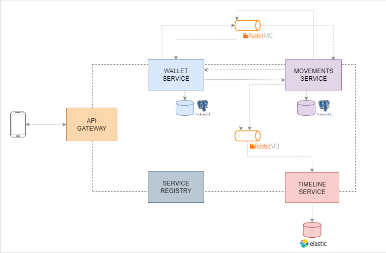
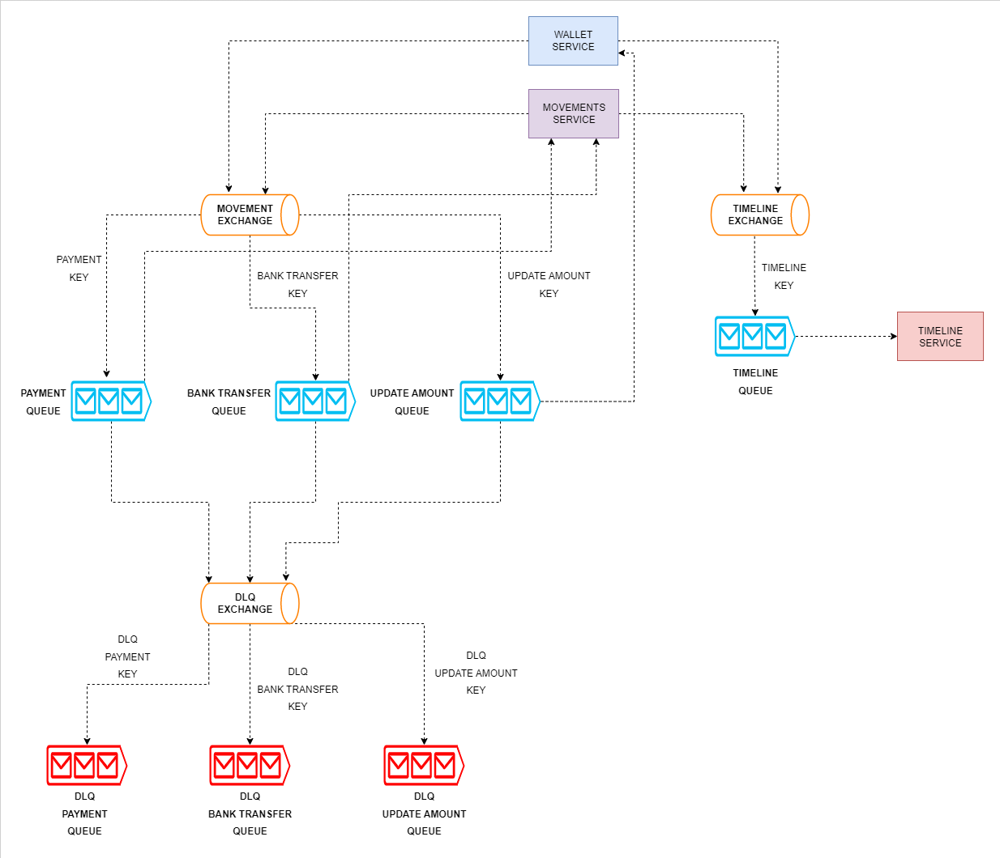

# WALLET - Sua carteira virtual

Sistema projetado para criação de uma carteira digital para realização de operações financeiras básicas como: transferência de valores entre usuários, saques, depósitos e pagamento de contas. A solução foi construida no modelo de uma API Rest se utilizando de microsserviços, usando as tecnologias mais usadas do Spring, contendo comunicações sincronas e assincronas se utilizando de filas de processamento.

## Arquitetura dos microsserviços

## Arquitetura de comunicação da filas

## Tecnologias utilizadas
- Spring Boot Starter Web
- Swagger (Springfox)
- Rabbitmq (Spring Boot Starter AMQP)
- PostgreSQL (Spring Data JPA)
- Elasticsearch (Spring Data Elasticsearch)
- Eureka Discovery Client (Spring Cloud Discovery)
- Eureka Server (Spring Cloud Discovery)
- Gateway (Spring Cloud Routing)
- Lombok
- ModelMapper
- Log4j2
- Docker

## Requisitos
Para montar o ambiente do projeto é essencial os componentes abaixo para sua correta construção

- Java 17
- Maven 3.8.6
- Docker

## Construção do ambiente dockerizado

Navegue até a pasta `docker` do projeto;

Abra um terminal de sua preferência e execute o seguinte comando:

`$ docker-compose up -d`

Depois confira se todos os containers foram inicializados:

`$ docker ps`

## Links auxiliares

- ### Service Registry
    - http://localhost:8761/

- ###  Rabbitmq
    - http://localhost:15672/#/
    - http://localhost:15672/#/exchanges
    - http://localhost:15672/#/queues

- ### Documentação
    - http://localhost:8080/picpay-wallet/swagger-ui/index.html#/
    - http://localhost:8080/picpay-movement/swagger-ui/index.html#/
    - http://localhost:8080/picpay-timeline/swagger-ui/index.html#/

## Navegue e se divirta pelo sistema!
Com intuito de facilitar sua jornada, criei uma collection contendo todas as URLs necessárias para seu teste!

[Click aqui para realizar o download](https://drive.google.com/u/0/uc?id=1VgmhMPZg-iOwZzd4T-iH-o0bXpiyW1fN&export=download)
